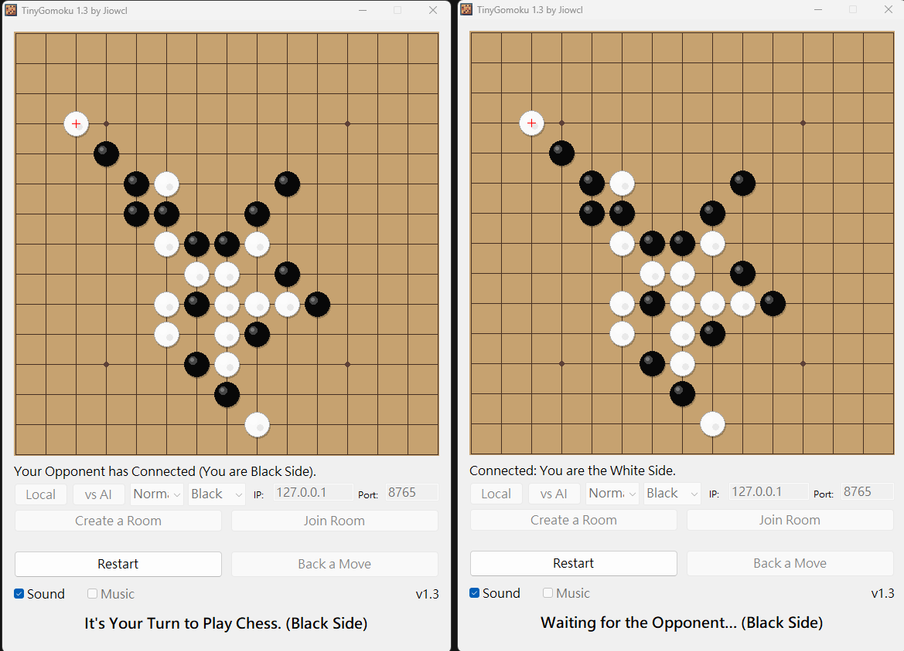

# TinyGomoku

A tiny Gomoku (Five in a Row) game written in PureBasic, with local play, AI, and LAN multiplayer.

## Environment

- Windows 11 above (recommend)
- PureBasic 6.40 above (recommend)

## How to Build

Building requires the PureBasic Compiler and is tested under Windows 11.  
Module features require PureBasic 5.20 and above.

Open `TinyGomoku/TinyGomoku.pbp` in PureBasic, or compile `TinyGomoku/TinyGomoku.pb` to `TinyGomoku/Output/TinyGomoku.exe`.

## How to Play

- **Local** — two players take turns on the same computer.
- **vs AI** — play against the built-in AI. Choose difficulty (`Easy` / `Normal` / `Hard`) and your side (`Black` / `White`) before or with Restart. Black moves first; if you pick White, the AI opens.
- **Create a Room** — host a LAN game (you play Black). Share your IP and port.
- **Join Room** — enter the host IP/port and connect (you play White).

**Restart** resets the board. **Back a Move** undoes one move in Local mode, or a human+AI pair in vs AI mode.  
**Sound** toggles SFX. **Music** toggles background music (requires `Sound/bgm.wav` or a tracker module next to the exe).  
Difficulty, side, IP/port, sound, and music preferences are remembered in `TinyGomoku.ini` next to the executable.

## Features

- Local two-player battle
- Local vs AI (Easy / Normal / Hard, choose Black or White; Hard uses threat combos + 1-ply reply check)
- LAN two-player battle (TCP)
- Remembered AI / network / sound / music preferences
- Optional BGM (`LoadMusic`) with fade-out on game end
- Place animation (ease + overshoot), shaded stones, win-line pulse, result fade-in
- Undo fade-out and short victory particle burst
- Four-in-a-row threat cue sound for the defending side
- Undo / Restart / Sound / Music toggles
- Version shown in the window title and UI (`v1.3`)

## License

Copyright (c) 2017-2026 Ji-Feng Tsai.  
Copyright (c) 効果音ラボ.  
Copyright (c) PANICPUMPKIN.  
Code released under the MIT license.

Icon: [AI Icon Generator](https://perchance.org/ai-icon-generator)  

## Donation

If this application help you reduce time to coding, you can give me a cup of coffee :)

[Paypal Me](https://paypal.me/jiowcl?locale.x=zh_TW)
